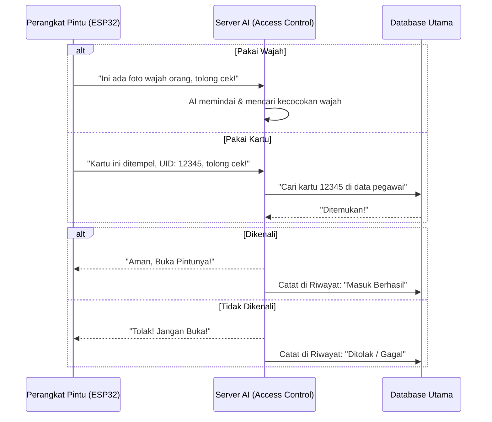
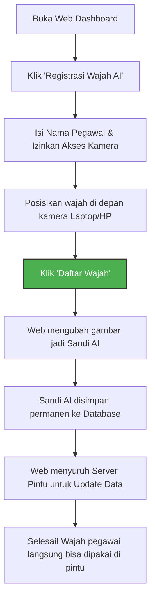
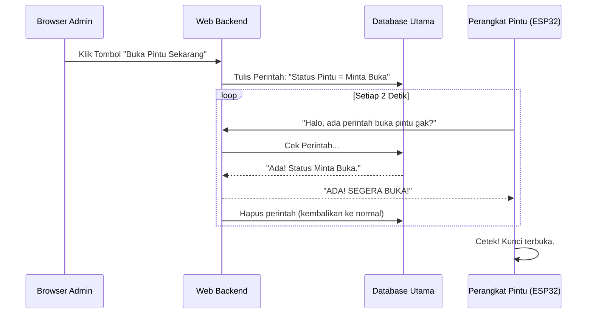

# Smart Door System - Skripsi UNAIR

Sistem keamanan pintu pintar berbasis **AI Face Recognition (Pengenalan Wajah)** dan **RFID** yang dirancang menggunakan arsitektur microservices untuk skalabilitas, stabilitas, dan kemudahan proses update (*CI/CD*).

---

## 🌟 Fitur Utama

1.  **Dual Authentication**: Membuka pintu bisa menggunakan wajah (kamera ESP32) atau menempelkan kartu RFID.
2.  **Web Registration (New)**: Mendaftarkan wajah baru sangat mudah, langsung lewat browser laptop/HP tanpa perlu aplikasi tambahan.
3.  **Real-time Dashboard**: Pantau siapa saja yang masuk/keluar, jam berapa, dan pakai metode apa secara *real-time*.
4.  **Buka Pintu Jarak Jauh**: Admin bisa membuka pintu dari web *dashboard* di mana pun berada.
5.  **Role-based Access**: Admin bisa melihat semua log pintu, User hanya bisa melihat log miliknya sendiri.
6.  **Auto-Update System (CI/CD)**: Otomatis mem-build dan memperbarui server tiap kali ada perubahan kode di GitHub.
7.  **Connection Pooling**: Anti-bocor dan sangat stabil meski koneksi ke database *Clever Cloud* putus-nyambung.

---

## 🏗️ Arsitektur Server (Kubernetes K3s)

Sistem ini berjalan di server **S2 (Ubuntu 24.04)** dengan orkestrasi **K3s**. Terdiri dari 2 service utama yang saling bekerja sama namun terpisah secara tugas:

### 1. Web Backend (`app-web`)
*   **Akses**: `https://iot.vps.prakhya.id`
*   **Fungsi Utama**: Menampilkan website (Dashboard, Login, Profil), manajemen user, pendaftaran wajah via webcam browser, ekspor PDF/CSV, dan integrasi Email OTP.
*   **Di Balik Layar**: Flask, MySQL Connection Pooling, Waitress.

### 2. Access Control (`access-control`)
*   **Akses**: `https://access-control-iot.vps.prakhya.id`
*   **Fungsi Utama**: Berkomunikasi langsung dengan perangkat keras (ESP32) di pintu. Menerima jepretan foto dari pintu, mengeceknya dengan AI, dan memberi instruksi "Buka" atau "Tolak" ke alat.
*   **Di Balik Layar**: Face Recognition API (dlib), OpenCV.

---

## 🔄 Alur Sistem (Flowchart Sederhana)

### 1. Cara Kerja Pintu Otomatis (Face & RFID)
*Bagaimana alat di pintu berkomunikasi dengan server saat ada orang yang mau masuk.*



### 2. Cara Kerja Pendaftaran Wajah Baru (Lewat Web)
*Bagaimana HRD/Admin menambahkan wajah pegawai baru.*



### 3. Cara Buka Pintu Jarak Jauh (Remote Bypass)
*Bagaimana Admin membukakan pintu untuk tamu dari lantai atas.*



---

## 🚀 Panduan Pembaruan Sistem (Auto-Deploy)

Aplikasi ini sudah dipasang **Pipeline Otomatis (GitHub Actions)**. 
Artinya, setiap kali Anda memperbaiki kode (*coding*) di komputer lokal lalu melakukan **push ke branch `production`**, server akan diperbarui secara otomatis tanpa perlu disentuh.

```bash
# 1. Tambah file yang diedit
git add .

# 2. Simpan perubahan
git commit -m "update tampilan dashboard"

# 3. Kirim ke GitHub (Server langsung ter-update!)
git push origin production
```

Jika karena suatu hal GitHub Actions mati, Admin masih bisa menekan tombol **Update Sistem** dari Web Dashboard (Menu Kanan Atas) untuk memaksa server memperbarui dirinya sendiri.

---
*Dibuat untuk kebutuhan Skripsi - Universitas Airlangga (UNAIR).*