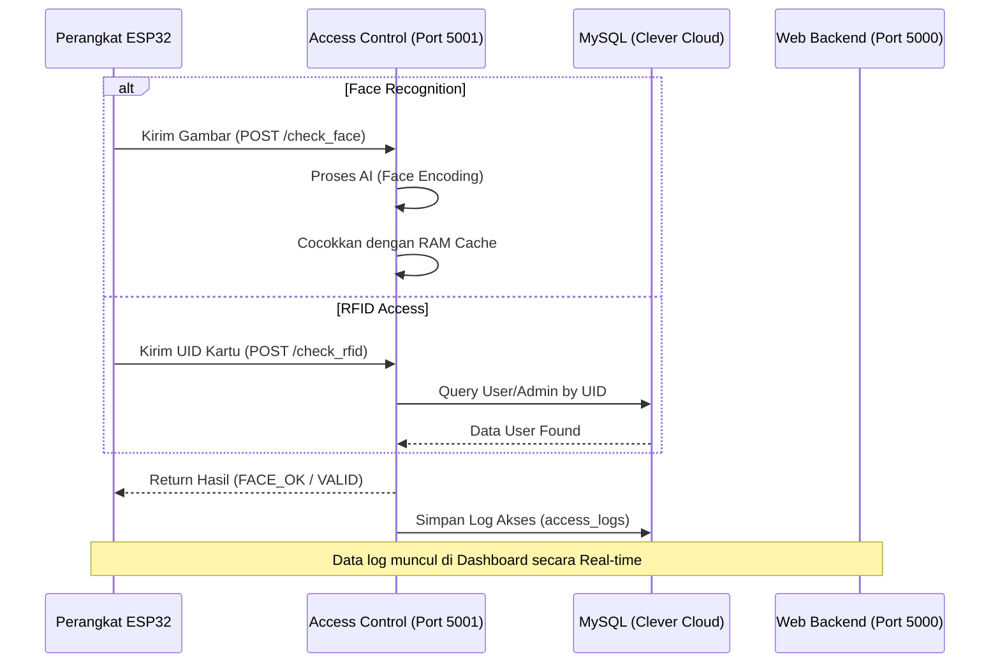
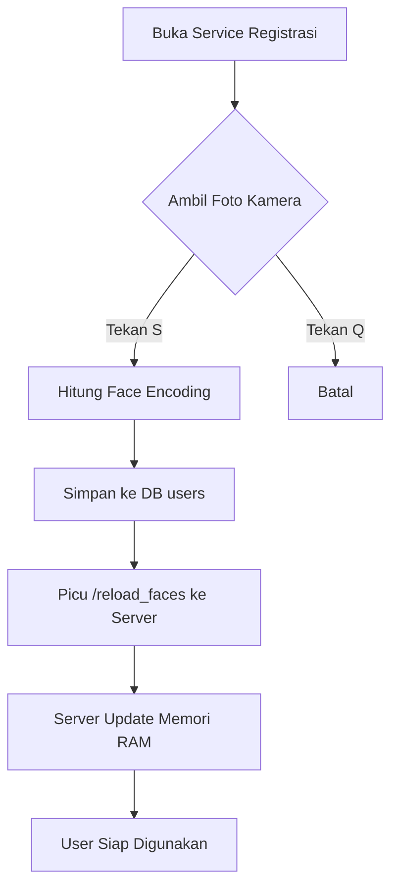
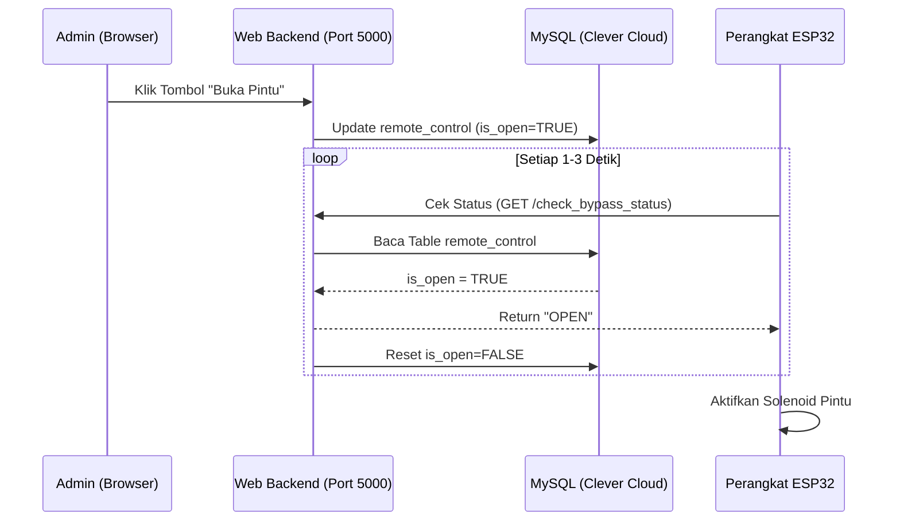

     1|# Smart Door System - Skripsi UNAIR
     2|
     3|Sistem keamanan pintu pintar berbasis **Face Recognition** (AI) dan **RFID** yang dirancang dengan arsitektur microservices untuk skalabilitas dan kemudahan deployment.
     4|
     5|## 🌟 Fitur Utama
     6|
     7|1.  **Dual Authentication**: Mendukung pengenalan wajah via ESP32-S3 CAM dan kartu RFID.
     8|2.  **Multi-Door Management**: Dapat mengelola akses untuk lebih dari satu pintu (`door1`, `door2`, dst).
     9|3.  **Real-time Monitoring**: Dashboard untuk memantau log akses secara langsung.
    10|4.  **Remote Bypass**: Membuka pintu secara manual melalui interface web oleh Admin.
    11|5.  **Role-based Access**: Perbedaan hak akses antara Admin (Superuser) dan User biasa.
    12|6.  **Self-Registration**: Registrasi wajah secara lokal yang terintegrasi langsung ke Cloud Database.
    13|7.  **OTP Verification**: Sistem registrasi admin yang aman dengan verifikasi OTP via email (integrasi Google Apps Script).
    14|8.  **Automated Logging**: Pencatatan otomatis setiap upaya akses, termasuk foto wajah yang tidak dikenal.
    15|
    16|---
    17|
    18|## 🏗️ Arsitektur Sistem
    19|
    20|Project ini dibagi menjadi 3 service utama yang berjalan di dalam container Docker:
    21|
    22|### 1. Web Dashboard (`app-web`)
    23|*   **Port**: 5000
    24|*   **Teknologi**: Flask (Python), Jinja2, MySQL.
    25|*   **Fungsi**: Menangani login admin, manajemen user, ekspor laporan CSV, dan aktivasi kartu/akun baru.
    26|
    27|### 2. AI Access Control (`access-control`)
    28|*   **Port**: 5001
    29|*   **Teknologi**: Face Recognition API (dlib), OpenCV, Waitress (Production Server).
    30|*   **Fungsi**: Mesin pemroses utama untuk validasi wajah dan RFID yang dikirim oleh perangkat hardware (ESP32).
    31|
    32|### 3. Face Registration (`face-registration`)
    33|*   **Mode**: Interaktif (Webcam Host)
    34|*   **Fungsi**: Tool khusus untuk mendaftarkan user baru dengan memindai struktur wajah dan menyimpannya ke database.
    35|
    36|---
    37|
    38|## 🗄️ Database Schema (MySQL)
    39|
    40|Sistem ini menggunakan beberapa tabel utama di Clever Cloud:
    41|*   `admins`: Menyimpan data kredensial pengelola, role, dan UID kartu manajer.
    42|*   `users`: Menyimpan data pegawai, encoding wajah (JSON), dan hak izin pintu.
    43|*   `access_logs`: Mencatat riwayat masuk (Waktu, Nama, Metode, Status).
    44|*   `remote_control`: Menyimpan status perintah buka pintu jarak jauh (Bypass).
    45|
    46|---
    47|
    48|
## 🔄 Alur Sistem (Flowcharts)

### 1. Alur Autentikasi (Face & RFID)
Alur ketika user mencoba masuk melalui perangkat hardware di pintu.



### 2. Alur Registrasi Wajah
Alur pendaftaran user baru agar wajahnya dikenali sistem.



### 3. Alur Remote Bypass (Buka via Web)
Alur ketika admin membuka pintu dari jarak jauh melalui dashboard.




## 🚀 Deployment ke Server S2
    49|
    50|Sistem ini dioptimalkan untuk berjalan di **Server S2 (31.97.49.12)** dengan konfigurasi berikut:
    51|
    52|### 1. Clone & Setup
    53|```bash
    54|git clone -b production https://github.com/IAMYANTO/web-skripsi.git
    55|cd web-skripsi
    56|```
    57|
    58|### 2. Environment Variables
    59|Pastikan kredensial database di `app.py`, `server.py`, dan `tambah_wajah.py` sudah sesuai. 
    60|*Note: Disarankan untuk menggunakan file .env di masa depan.*
    61|
    62|### 3. Run with Docker Compose
    63|```bash
    64|docker-compose up -d --build
    65|```
    66|
    67|### 4. Port Forwarding / Ingress
    68|Pastikan port **5000** (Web) dan **5001** (API) terbuka di firewall server atau di-routing melalui domain jika menggunakan Reverse Proxy (seperti Caddy/Nginx yang ada di S1).
    69|
    70|---
    71|
    72|## 🔌 Integrasi Hardware (ESP32)
    73|
    74|Perangkat ESP32 harus dikonfigurasi untuk menembak IP Server S2:
    75|*   **Face API**: `http://31.97.49.12:5001/check_face?door_id=door1`
    76|*   **RFID API**: `http://31.97.49.12:5001/check_rfid` (Method: POST)
    77|*   **Bypass Check**: `http://31.97.49.12:5000/check_bypass_status?door_id=door1`
    78|
    79|---
    80|*Dibuat untuk kebutuhan Skripsi - Universitas Airlangga (UNAIR).*
    81|